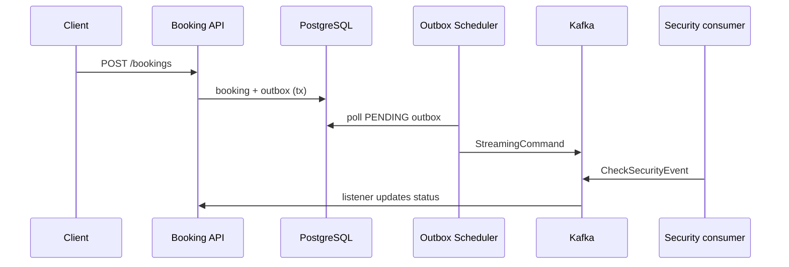

# Booking Service

Микросервис бронирования номеров в рамках event-driven архитектуры: REST API, PostgreSQL, Apache Kafka, паттерн **Transactional Outbox**, observability (Actuator, Prometheus, OpenTelemetry).

## Возможности

- CRUD-поток бронирования: создание, получение по ID, обновление статуса
- Валидация входных данных (Bean Validation)
- Асинхронная оркестрация: после создания брони в outbox записывается команда проверки безопасности
- Планировщик публикует сообщения из outbox в Kafka (at-least-once + идемпотентность на стороне consumer)
- Обработка ответа проверки безопасности через Kafka listener
- OpenAPI / Swagger UI, централизованная обработка ошибок
- Docker, Kubernetes manifests, GitLab CI

## Стек

Java 17 · Spring Boot 3.4 · Spring Data JPA · Liquibase · Spring Kafka · MapStruct · Micrometer · springdoc-openapi

## Быстрый старт (локально)

### 1. Инфраструктура

```bash
cp .env.sample .env
docker compose --env-file .env up -d db kafka-1 kafka-2 kafka-3
```

### 2. Приложение

```bash
./mvnw spring-boot:run
```

По умолчанию: `http://localhost:8080` (порт задаётся `SERVER_PORT`).

- Swagger UI: `http://localhost:8080/swagger-ui/index.html`
- Health: `http://localhost:8080/actuator/health`

### 3. Пример запроса

```bash
curl -X POST http://localhost:8080/api/v1/bookings \
  -H "Content-Type: application/json" \
  -d '{
    "userId": 1,
    "roomId": 101,
    "checkInDate": "2026-06-01",
    "checkOutDate": "2026-06-05",
    "guestsCount": 2,
    "totalPrice": 420.00
  }'
```

## API

| Метод | Путь | Описание |
|-------|------|----------|
| POST | `/api/v1/bookings` | Создать бронирование |
| GET | `/api/v1/bookings/{requestId}` | Получить бронирование |
| PATCH | `/api/v1/bookings/{requestId}` | Обновить статус |

Статусы: `CREATED`, `PENDING`, `CONFIRMED`, `CHECKED_IN`, `CHECKED_OUT`, `CANCELLED`, `SECURITY_FAILED`, `NO_SHOW`.

## Архитектура (упрощённо)



## Тесты

```bash
./mvnw test
```

Unit-тесты для сервисного слоя и `@WebMvcTest` для REST-контроллера.

## Сборка и деплой

```bash
./mvnw -DskipTests package
docker build -t booking-service:local .
```

Манифесты Kubernetes — каталог `k8s/`. Pipeline — `.gitlab-ci.yml`.

## Конфигурация

Основные переменные окружения см. в `.env.sample` и `src/main/resources/application.yaml`.

## Лицензия

См. [LICENSE](LICENSE).
