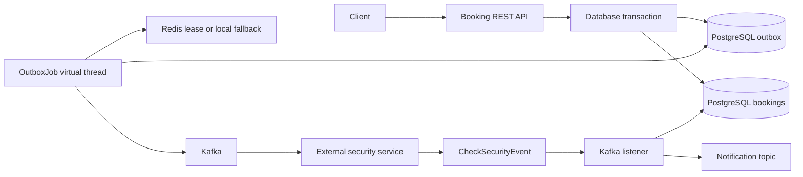

# Booking Service

Сервис принимает и сопровождает бронирования номеров. Он сохраняет заявку в PostgreSQL, ставит её на асинхронную проверку безопасности через Kafka и получает результат этой проверки. Надёжность публикации обеспечивается паттерном Transactional Outbox.

## Что уже реализовано

- Создание бронирования, получение по ID и изменение статуса через REST API.
- Валидация дат, количества гостей и положительной стоимости.
- Контролируемые переходы статусов: нельзя, например, перевести новую бронь сразу в `CHECKED_OUT`.
- Атомарное сохранение бронирования и outbox-команды в одной БД-транзакции.
- Управляемая публикация outbox-команд в Kafka: `NEW → IN_PROGRESS → SUCCESS | ERROR`.
- Защита от конкурентной обработки через атомарную смену статуса в PostgreSQL и Redis lease с локальным fallback.
- Получение `CheckSecurityEvent`: успешная проверка переводит бронь в `PENDING`, неуспешная — в `SECURITY_FAILED` и публикует notification-команду.
- OpenAPI/Swagger, Actuator health и централизованные HTTP-ошибки.

Проверку выполняет отдельный публичный сервис [booking-security](https://github.com/SergeyPynzar/booking-security). Он читает `CheckSecurityCommand` из `jdmik12.security.check.command`, проверяет положительность `userId` и `roomId`, затем публикует `CheckSecurityEvent` в `jdmik12.booking-pr.event`. Consumer уведомлений пока является внешней интеграцией. Пока security consumer не запущен, бронь останется в `CREATED` — это ожидаемое поведение.

## Стек

Java 21, Spring Boot 3.5, Spring Web, Spring Data JPA, PostgreSQL, Liquibase, Apache Kafka, MapStruct, Lombok, Micrometer/Actuator, Prometheus, OpenTelemetry, springdoc-openapi, JUnit 5, Mockito и Testcontainers.

## Устройство



1. `POST /api/v1/bookings` создаёт бронь в `CREATED` и outbox-запись `NEW`.
2. `OutboxJob` в виртуальном потоке выбирает ограниченный batch свежих `NEW` записей. Лимиты и период job настраиваются через `OUTBOX_BATCH_SIZE`, `OUTBOX_LOOKBACK_DAYS`, `OUTBOX_FIXED_DELAY`.
3. После подтверждения Kafka запись становится `SUCCESS`; при ошибке публикации — `ERROR`.
4. Внешний security-сервис публикует `CheckSecurityEvent` в reply topic, а listener обновляет статус бронирования.

## API

| Метод | Endpoint | Назначение |
| --- | --- | --- |
| POST | `/api/v1/bookings` | Создать бронирование; ответ `201` содержит ID заявки. |
| GET | `/api/v1/bookings/{id}` | Получить бронирование. |
| PATCH | `/api/v1/bookings/{id}` | Изменить статус согласно разрешённому жизненному циклу. |
| GET | `/actuator/health` | Проверить готовность приложения. |

Основные статусы: `CREATED`, `PENDING`, `CONFIRMED`, `CHECKED_IN`, `CHECKED_OUT`, `CANCELLED`, `SECURITY_FAILED`, `NO_SHOW`.

Пример создания:

```bash
curl -X POST http://localhost:8080/api/v1/bookings \
  -H "Content-Type: application/json" \
  -d '{"userId":1,"roomId":101,"checkInDate":"2026-11-01","checkOutDate":"2026-11-05","guestsCount":2,"totalPrice":420.00}'
```

## Запуск за несколько минут

Требования: JDK 21, Docker Desktop с запущенным daemon и Docker Compose.

1. Подготовьте переменные:

```powershell
Copy-Item .env.sample .env
```

На Linux/macOS: `cp .env.sample .env`.

2. Запустите PostgreSQL и Kafka-кластер из трёх broker (это необходимо, так как topic создаётся с replication factor 3):

```powershell
docker compose --env-file .env up -d db kafka-1 kafka-2 kafka-3
```

3. Запустите сервис:

```powershell
.\mvnw.cmd spring-boot:run
```

На Linux/macOS: `./mvnw spring-boot:run`.

Проверьте:

- Swagger: `http://localhost:8080/swagger-ui/index.html`
- Health: `http://localhost:8080/actuator/health`
- API: `http://localhost:8080/api/v1/bookings`

## Проверки и сборка

```powershell
.\mvnw.cmd test
.\mvnw.cmd package -DskipTests
docker build -t booking-service:local .
```

Тесты покрывают REST-контроллер, сервис бронирований, обработку security-событий, успешную и ошибочную публикацию outbox. Интеграционный тест Liquibase/PostgreSQL запускается автоматически, если доступен Docker; иначе Maven помечает его как skipped.

## Конфигурация и доставка

Локальные параметры находятся в [`.env.sample`](.env.sample), основная Spring-конфигурация — в [`application.yaml`](src/main/resources/application.yaml). Для локального запуска и проверки сервиса используется [`docker-compose.yml`](docker-compose.yml); реальные секреты остаются в локальном `.env` и не попадают в Git.
